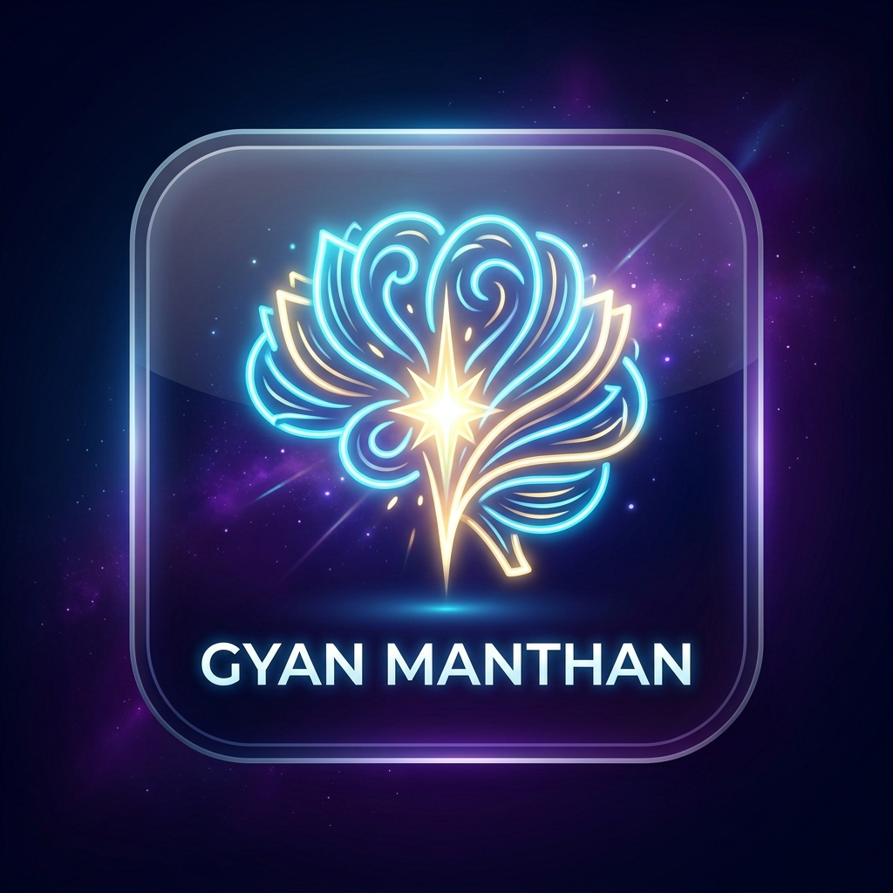
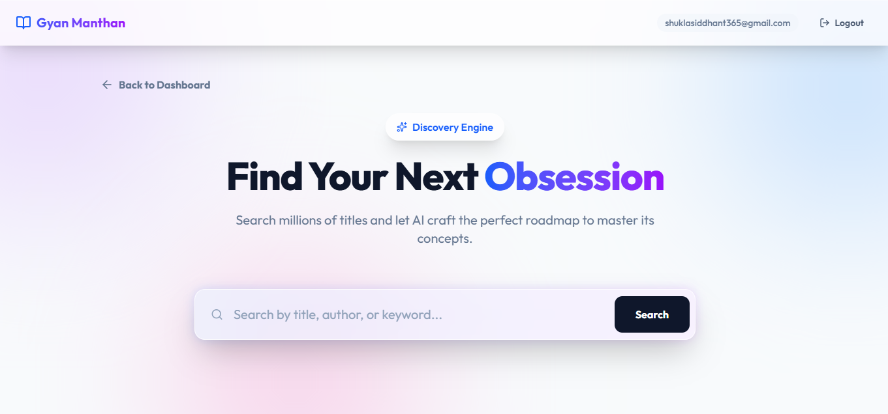

<div align="center">
  
  
  # Gyan Manthan
  *Churn Wisdom from Every Page.*

  [](https://reactjs.org/)
  [](https://vitejs.dev/)
  [](https://tailwindcss.com/)
  [](https://expressjs.com/)
  [](https://www.mongodb.com/)
  [](https://groq.com/)
  [](LICENSE)
  [](https://gyan-manthan-one.vercel.app/)

</div>

<br />

> **Gyan Manthan** is an elegant, AI-powered reading companion designed to distill the world's knowledge into personalized, actionable reading plans. By leveraging cutting-edge LLMs (via Groq), it crafts multilingual reading schedules, explains complex metaphors, and extracts actionable wisdom from any book.

---

## 🌟 Key Features

- **🧠 AI-Crafted Reading Plans:** Search millions of books and let the "Discovery Engine" split them into perfectly sized daily sessions (Fast Track, Deep Study, Productivity, Exam, or Spiritual).
- **🗣️ Multilingual Support:** Generate plans and deeply understand texts in your native language (English, Hindi, Tamil, Telugu, Urdu, Bengali, Spanish, French).
- **✨ Deep AI Explanations:** Highlight any confusing sentence inside the reading pane, and our AI will break down its core philosophy, metaphor structure, and practical real-world application.
- **📈 Progress Tracking:** An interactive dashboard with progress bars to keep you motivated on your reading journey.
- **💎 Premium Glassmorphic UI:** A beautifully designed interface using Tailwind CSS v4 featuring abstract glows, fluid animations, and high-end typography.
- **🔒 Secure Authentication:** Powered by Firebase Authentication and securely synced with a MongoDB backend.

---

## 📸 Sneak Peek



---

## 🚀 Quick Start

### Prerequisites

- Node.js (v18+)
- MongoDB connection string ([Get one free on MongoDB Atlas](https://www.mongodb.com/cloud/atlas))
- Groq API Key ([Get it here](https://console.groq.com/keys))
- Firebase project ([Create one here](https://console.firebase.google.com/))

---

### 1. Clone the Repository

```bash
git clone https://github.com/siddhantshukla108/Gyan-Manthan.git
cd Gyan-Manthan
```

---

### 2. Server Setup

```bash
cd server
npm install
```

Create a `.env` file in the `/server` directory:

```env
PORT=5000
MONGODB_URI=your_mongodb_connection_string
GROQ_API_KEY=your_groq_api_key
CLIENT_URL=http://localhost:5173
```

**Firebase Service Account Key Setup:**
1. Go to [Firebase Console](https://console.firebase.google.com/) → Your Project → ⚙️ Project Settings
2. Navigate to the **Service Accounts** tab
3. Click **"Generate new private key"** and download the JSON file
4. Rename it to `firebaseServiceAccountKey.json`
5. Place it in the root of the `/server` directory

> ⚠️ Never commit this file to GitHub — it's already in `.gitignore`.

```bash
# Start the backend
npm run dev
```

---

### 3. Client Setup

```bash
cd ../client
npm install
```

Create a `.env` file in the `/client` directory:

```env
VITE_API_URL=http://localhost:5000/api

# Firebase Web App Config
# Get these from: Firebase Console → Project Settings → General → Your Apps → Web App
VITE_FIREBASE_API_KEY=your_firebase_api_key
VITE_FIREBASE_AUTH_DOMAIN=your_project_id.firebaseapp.com
VITE_FIREBASE_PROJECT_ID=your_project_id
VITE_FIREBASE_STORAGE_BUCKET=your_project_id.appspot.com
VITE_FIREBASE_MESSAGING_SENDER_ID=your_messaging_sender_id
VITE_FIREBASE_APP_ID=your_firebase_app_id
```

**How to get Firebase Web Config:**
1. Go to [Firebase Console](https://console.firebase.google.com/) → Your Project → ⚙️ Project Settings
2. Scroll down to **"Your apps"** → Select your **Web App** (or create one)
3. Copy the config values into your `.env` file as shown above

```bash
# Start the frontend
npm run dev
```

---

### 4. Enjoy! 🎉

Open your browser and navigate to `http://localhost:5173`

---

## 🛠 Tech Stack Deep Dive

| Layer | Technology |
|---|---|
| **Frontend** | React 19, Vite, Tailwind CSS v4, Framer Motion, React-Hot-Toast, Lucide-React |
| **Backend** | Node.js, Express.js 5, Firebase Admin SDK, Express Rate Limit |
| **Database** | MongoDB & Mongoose |
| **Authentication** | Firebase Authentication |
| **AI Integration** | Groq API (Llama 3.1 8B Instant) |

---

## 📁 Project Structure

```
Gyan-Manthan/
├── assets/                          # Static assets (logo, screenshots)
├── client/                          # React frontend (Vite)
│   ├── src/
│   └── .env                         # ← Create this (see Client Setup)
├── server/                          # Express backend
│   ├── .env                         # ← Create this (see Server Setup)
│   └── firebaseServiceAccountKey.json  # ← Add this (never commit!)
├── LICENSE
├── .gitignore
└── README.md
```

---

## 🤝 Contributing

Contributions are welcome! Here's how to get started:

1. Fork the repository
2. Create a new branch: `git checkout -b feature/your-feature-name`
3. Make your changes and commit: `git commit -m "Add your feature"`
4. Push to your branch: `git push origin feature/your-feature-name`
5. Open a Pull Request

Please make sure your code is clean and follows the existing style before submitting.

---

## 📄 License

This project is licensed under the [MIT License](LICENSE) — feel free to use, modify, and distribute it.

---

<div align="center">
  <i>"Churn Wisdom from Every Page."</i>
  <br/><br/>
  Made with ❤️ by <a href="https://github.com/siddhantshukla108">Siddhant Shukla</a>
</div>
